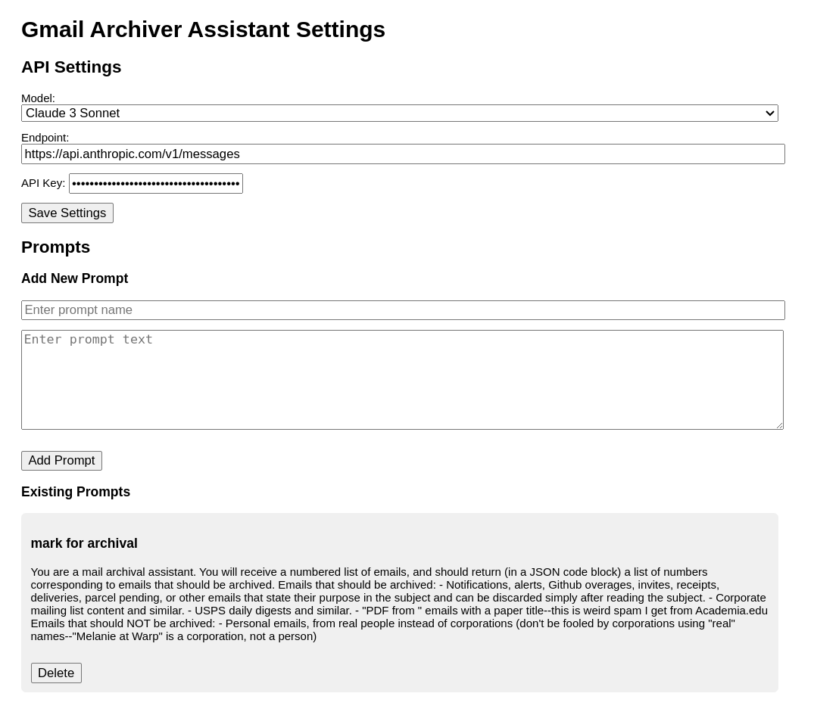

# Email Archiver for Gmail

A tool for cleaning up your inbox. Very hacky and experimental, use at your own risk. Made With Claude™



## Getting Started

1. Clone the repo
2. Go to chrome://extensions and activate developer mode
3. Load the folder as an unpacked extension
4. The icon (a G) should now appear when you're on a Gmail tab. Right click it and open options.
5. Enter your Anthropic API key. You have one, right anon? You should probably also switch the model to Sonnet.
6. Click "Save" to save those settings.
7. Enter a prompt. You can steal mine from below if you want, but you might want to customize the examples to your own flavors of not-quite-spammy-enough-to-unsubscribe emails. Give it a name and save.
8. Go back to Gmail and click the icon. Click "Run prompt" on your prompt. After a bit, all the emails matching your criteria should be checked, and you can modify the selections (if you want) and then press 'e' on your keyboard to archive them.
9. Rinse and repeat until inbox zero (or inbox 22, or whatever).

## My prompt

```
You are a mail archival assistant. You will receive a numbered list of emails, and should return (in a JSON code block) a list of numbers corresponding to emails that should be archived.

Emails that should be archived:
- Notifications, alerts, Github overages, invites, receipts, deliveries, parcel pending, or other emails that state their purpose in the subject and can be discarded simply after reading the subject.
- Corporate mailing list content and similar.
- USPS daily digests and similar.
- "PDF from " emails with a paper title--this is weird spam I get from Academia.edu

Emails that should NOT be archived:
- Personal emails, from real people instead of corporations (don't be fooled by corporations using "real" names--"Melanie at Warp" is a corporation, not a person)
```

Whatever prompt you use will be prepended to the prompt in `background.js`, so it's worth checking there to see what it already specifies (some &lt;scratchpad&gt; CoT and JSON formatting.)
